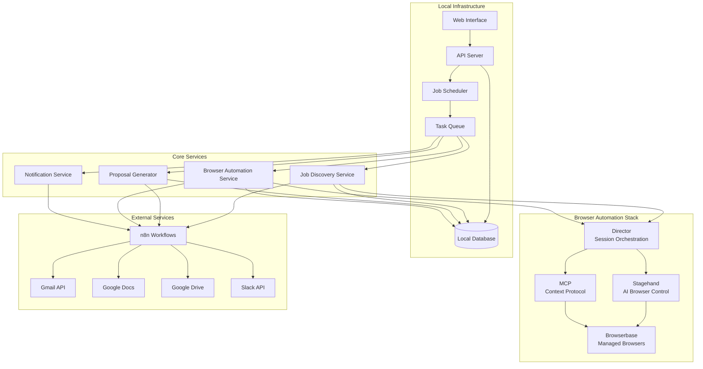
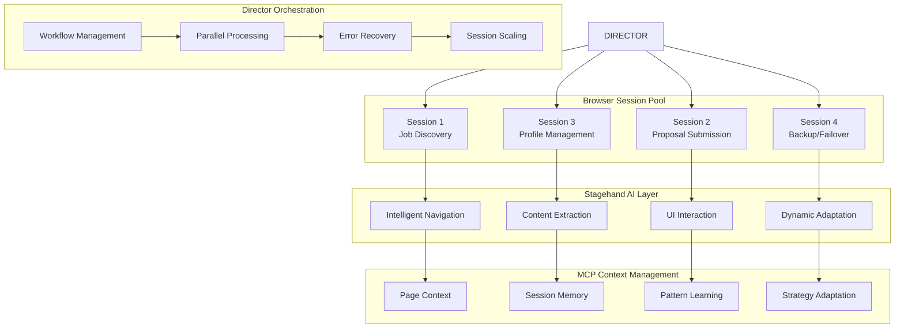

# Design Document

## Overview

The Upwork Automation System is designed as a locally-hosted application that automates the job discovery, proposal generation, and application submission process for Salesforce Agentforce Developer positions. The system scales from 2-3 manual applications to 20-30 automated applications per day while maintaining platform compliance and account safety.

The architecture follows a microservices approach with clear separation of concerns: job discovery, proposal generation, browser automation, and monitoring. All components run locally with integrations to cloud services (Browserbase, n8n, Google Workspace) for enhanced capabilities.

## Architecture

### High-Level Architecture



### Browser Automation Architecture Deep Dive



### Component Architecture

The system is built using a browser-automation-centric architecture with the following key components:

1. **Browser Automation Layer**: Browserbase + Stagehand + Director + MCP for intelligent browser control
2. **n8n Orchestration**: Workflow automation connecting browser actions with business logic
3. **Web Interface**: React-based dashboard for monitoring and control
4. **API Server**: FastAPI-based REST API for all system operations
5. **Job Scheduler**: Cron-like scheduler for automated job discovery and processing
6. **Task Queue**: Redis-based queue for asynchronous task processing
7. **Core Services**: Specialized services for each major function
8. **Database**: PostgreSQL for persistent data storage

**Browser Automation Stack**:
- **Browserbase**: Managed browser infrastructure with 4 vCPU per browser, session persistence, stealth mode, proxy support
- **Stagehand**: AI-powered browser automation for complex UI interactions and dynamic content handling
- **Director**: Multi-session orchestration and workflow management for parallel processing
- **MCP**: Model Context Protocol for AI agent integration with browser contexts
- **n8n**: Low-code workflow automation connecting browser automation with external services

## Components and Interfaces

### 1. Web Interface

**Technology**: React with TypeScript, Material-UI for components

**Key Features**:
- Real-time dashboard showing job queue status and metrics
- Job detail views with proposal preview and edit capabilities
- System configuration and filter management
- Performance analytics and success rate tracking
- Manual override controls for pausing/resuming automation

**API Integration**: RESTful API calls to the local API server with WebSocket connections for real-time updates.

### 2. API Server

**Technology**: FastAPI with Python, SQLAlchemy ORM

**Endpoints**:
```
GET /api/jobs - List jobs with filtering and pagination
GET /api/jobs/{id} - Get specific job details
POST /api/jobs/{id}/apply - Manually trigger application
PUT /api/jobs/{id} - Update job status or proposal
GET /api/metrics - System performance metrics
POST /api/settings - Update system configuration
GET /api/queue/status - Current queue status
```

**Authentication**: JWT-based authentication for web interface access

### 3. Job Discovery Service

**Technology**: Browserbase + Stagehand + n8n integration

**Advanced Browser-Based Discovery**:
The job discovery service leverages the full browser automation stack for intelligent job hunting:

**Responsibilities**:
- **AI-Powered Job Search**: Stagehand for intelligent navigation and search optimization
- **Dynamic Content Handling**: MCP for adapting to Upwork's changing UI and anti-bot measures
- **Multi-Session Parallel Discovery**: Director orchestrating multiple browser sessions for faster discovery
- **Context-Aware Filtering**: AI agents understanding job context beyond simple keyword matching
- **n8n Workflow Integration**: Connecting browser discovery with Gmail alerts and notification systems

### 4. Proposal Generator

**Technology**: Python with OpenAI API, Google Docs API

**Responsibilities**:
- LLM-based proposal generation using job-specific context
- Template management and customization
- Google Docs integration for proposal storage
- Attachment selection from Google Drive assets

### 5. Browser Automation Service

**Technology**: Browserbase with Stagehand, Director, MCP integration, n8n orchestration

**Core Architecture**:
The browser automation is the heart of this system, leveraging Browserbase's managed browser infrastructure with advanced automation frameworks:

- **Browserbase**: Managed headless browsers with 4 vCPU per browser, session recording, stealth capabilities, and proxy support
- **Stagehand**: AI-powered browser automation for complex UI interactions and dynamic content handling
- **Director**: Orchestration layer for managing multiple browser sessions and workflows
- **MCP (Model Context Protocol)**: Integration layer for AI agents to interact with browser contexts
- **n8n**: Workflow orchestration connecting browser automation with other services

**Detailed Responsibilities**:
- **Session Management**: Persistent browser sessions across multiple job applications with context preservation
- **Stealth Operations**: Advanced fingerprinting, proxy rotation, and human-like interaction patterns
- **AI-Powered Navigation**: Stagehand for intelligent element detection and interaction in dynamic Upwork UI
- **Multi-Session Orchestration**: Director managing parallel browser sessions for scaled application processing
- **Context-Aware Automation**: MCP enabling AI agents to understand and adapt to changing page contexts
- **Workflow Integration**: n8n connecting browser actions with proposal generation, notifications, and data storage

### 6. n8n Workflow Orchestration

**Technology**: n8n with custom nodes and webhook integrations

**Core Workflows**:

**Job Discovery Workflow**:
- Browser-based job search with parallel session management
- AI-powered job filtering and ranking
- Slack notifications with job details and screenshots
- Automatic proposal generation triggering

**Proposal Generation Workflow**:
- Job requirement analysis using OpenAI
- Proposal content generation with templates
- Google Docs creation and attachment selection
- Queue management for submission workflow

**Browser Automation Workflow**:
- Session management and stealth operations
- Stagehand-powered form filling and submission
- Director orchestration for complex workflows
- Confirmation capture and result processing

### 7. Notification Service

**Technology**: n8n + Slack SDK integration

**Enhanced Notification System**:
- **Real-time Job Alerts**: Rich Slack cards with job details and browser screenshots
- **Proposal Status Updates**: Live updates on proposal generation and submission
- **Error Handling Alerts**: Immediate notifications for browser automation failures
- **Performance Dashboards**: Daily/weekly summary reports with success metrics
- **Interactive Controls**: Slack buttons for manual overrides and emergency stops

## Data Models

### Job Model
```python
class Job(BaseModel):
    id: str
    title: str
    description: str
    budget_min: Optional[float]
    budget_max: Optional[float]
    hourly_rate: Optional[float]
    client_rating: float
    client_payment_verified: bool
    client_hire_rate: float
    posted_date: datetime
    deadline: Optional[datetime]
    skills_required: List[str]
    job_type: JobType  # FIXED, HOURLY
    location: Optional[str]
    status: JobStatus  # DISCOVERED, FILTERED, QUEUED, APPLIED, REJECTED
    match_score: float
    created_at: datetime
    updated_at: datetime
```

### Proposal Model
```python
class Proposal(BaseModel):
    id: str
    job_id: str
    content: str
    bid_amount: float
    attachments: List[str]  # Google Drive file IDs
    google_doc_url: str
    generated_at: datetime
    submitted_at: Optional[datetime]
    status: ProposalStatus  # DRAFT, SUBMITTED, ACCEPTED, REJECTED
```

### Application Model
```python
class Application(BaseModel):
    id: str
    job_id: str
    proposal_id: str
    submitted_at: datetime
    upwork_application_id: Optional[str]
    status: ApplicationStatus
    client_response: Optional[str]
    client_response_date: Optional[datetime]
    interview_scheduled: bool
    hired: bool
```

### System Configuration Model
```python
class SystemConfig(BaseModel):
    daily_application_limit: int = 30
    min_hourly_rate: float = 50.0
    target_hourly_rate: float = 75.0
    min_client_rating: float = 4.0
    min_hire_rate: float = 0.5
    keywords_include: List[str]
    keywords_exclude: List[str]
    automation_enabled: bool = True
    notification_channels: List[str]
```

## Error Handling

### Browser Automation Errors
- **Session Timeout**: Automatic session refresh with exponential backoff
- **CAPTCHA Detection**: Pause automation and send alert notification
- **Rate Limiting**: Implement delays and reduce application frequency
- **Login Failures**: Alert team and require manual intervention

### API Integration Errors
- **Google Services**: Retry with exponential backoff, fallback to local storage
- **Slack Notifications**: Queue failed notifications for retry
- **Browserbase**: Switch to backup browser sessions or pause automation

### Data Consistency
- **Database Transactions**: Use database transactions for multi-step operations
- **Queue Processing**: Implement idempotent task processing with unique job IDs
- **State Management**: Regular state synchronization between services

## Testing Strategy

### Unit Testing
- **Service Layer**: Mock external dependencies, test business logic
- **Data Models**: Validate model constraints and relationships
- **API Endpoints**: Test request/response handling and validation
- **Browser Automation**: Mock Browserbase interactions, test flow logic

### Integration Testing
- **End-to-End Workflows**: Test complete job discovery to application flow
- **External Service Integration**: Test with actual APIs in staging environment
- **Database Operations**: Test data persistence and retrieval
- **Queue Processing**: Test task distribution and completion

### Performance Testing
- **Load Testing**: Simulate high job volumes and concurrent processing
- **Browser Session Management**: Test session pooling and cleanup
- **Database Performance**: Test query performance with large datasets
- **Memory Usage**: Monitor memory consumption during extended runs

### Safety Testing
- **Rate Limiting**: Verify application frequency stays within safe limits
- **Error Recovery**: Test system behavior during various failure scenarios
- **Data Validation**: Test input sanitization and validation
- **Security**: Test credential handling and API security